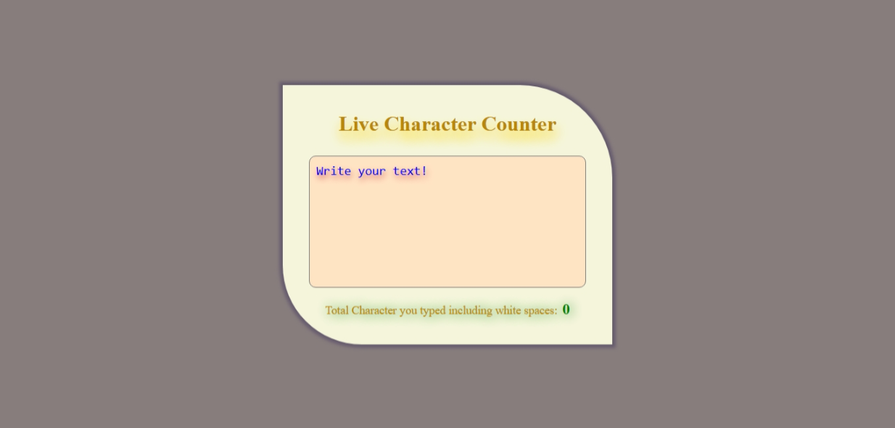
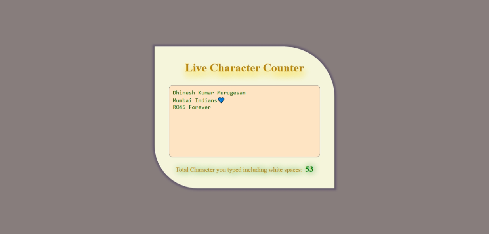

# Live Character Counter ✏️

This is a simple web-based **Live Character Counter** application built using HTML, CSS, and JavaScript. It counts the number of characters typed in a `textarea`, including white spaces, and displays the result instantly.

## 🔗 Live Demo

[Click here to view the live project](https://msdhinesh45.github.io/live-character-count/)  

## 📸 Output Screens

### 🖼️ Output 1

### 🖼️ Output 2

## 💻 Technologies Used

- **HTML** – Structure of the web page  
- **CSS** – Styling the layout  
- **JavaScript** – Live character count logic

## 📜 How It Works

- User types inside the `textarea`.  
- The `onkeyup` event triggers a JavaScript function.  
- The function counts the number of characters typed (including white spaces).  
- The result is dynamically displayed below the `textarea`.

## ✍️ Author

**Dhinesh Kumar**
